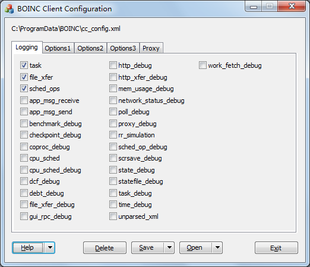

# boinc-client-configuration

A Windows GUI for [BOINC client configuration](http://boinc.berkeley.edu/wiki/Client_configuration) (cc\_config.xml).

Please let me know if you find anything wrong or have any suggestions (zenith.yin#at#gmail#dot#com).

Target User:
  1. BOINC Developers or volunteer developers
  1. BOINC users participating challenges often
  1. BOINC users crunching with GPUs
  1. ...

